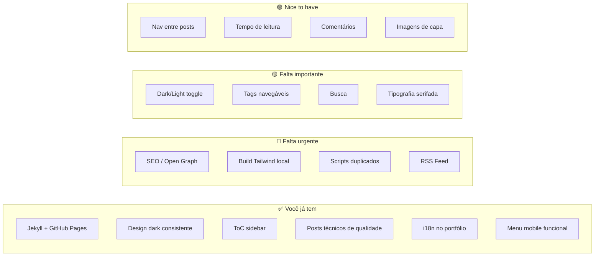

# 🔍 Análise Comparativa: AkitaOnRails.com vs. Herton Blog

## 1. Características do Blog do Akita (Referência)

O blog do Akita é um projeto maduro e altamente polido. Aqui estão as escolhas de design que se destacam:

| Aspecto | Escolha do Akita |
|---|---|
| **Gerador** | Hugo (estático, extremamente rápido) |
| **Tema** | Hextra, customizado pesadamente com CSS próprio |
| **Tipografia** | Source Serif 4 (corpo) + Source Sans 3 (títulos) — fontes profissionais do Google Fonts, com `text-rendering: optimizeLegibility` e `font-kerning: normal` |
| **Largura de leitura** | `max-width: 68ch` — coluna estreita ideal para legibilidade |
| **Tamanho de fonte** | `19px` para corpo de texto — generoso, confortável |
| **Line-height** | `1.7` — excelente espaçamento entre linhas |
| **Dark/Light mode** | Toggle com 3 opções (Claro, Escuro, Sistema) e persistência via `localStorage` |
| **Busca** | Sistema duplo: filtro client-side via JSON (omnibar com `Ctrl+K`) + DuckDuckGo como fallback |
| **SEO** | Open Graph, Twitter Cards, JSON-LD (Schema.org), canonical URL, meta description |
| **RSS** | Feed RSS nativo com ícone no navbar |
| **Internacionalização** | PT/EN com cookie de preferência e detecção automática de idioma do navegador |
| **Navegação lateral** | Sidebar com categorias + ToC (Índice de Conteúdo) sticky na direita |
| **Layout de listagem** | Duas visualizações: Lista e Grid (cards), agrupados por mês/ano, com toggle visual |
| **Tags** | Sistema de tags clicáveis com páginas dedicadas por tag |
| **CSS Avançado** | Ícones inline de redes sociais via CSS masks, custom scrollbar, animações com `prefers-reduced-motion`, `color-mix()` |
| **Performance** | CSS minificado com SRI (hash de integridade), preload, preconnect |
| **Comentários** | Disqus integrado com estilo customizado |
| **Cor de destaque** | Vermelho terroso/cobre (`#a63a1e` light / `#e2a05a` dark) com variáveis CSS (`--aor-accent`) |
| **Links externos** | Ícones automáticos por domínio (GitHub, YouTube, Twitter, etc.) via CSS `::after` |

---

## 2. Estado Atual do Seu Blog

| Aspecto | Situação Atual |
|---|---|
| **Gerador** | Jekyll (GitHub Pages nativo) |
| **CSS Framework** | Tailwind via CDN (`cdn.tailwindcss.com`) — não ideal para produção |
| **Tipografia** | Fonte padrão do sistema (`font-sans`) sem refinamento tipográfico |
| **Largura de leitura** | `max-w-2xl` na listagem, `max-w-3xl` no post — razoável |
| **Dark/Light mode** | ❌ Apenas dark (hardcoded `bg-slate-950`) |
| **Busca** | ❌ Inexistente |
| **SEO** | ❌ Sem Open Graph, sem Twitter Cards, sem JSON-LD, sem meta description |
| **RSS** | ❌ Inexistente |
| **Tags/Categorias** | Definidas no frontmatter mas **não exibidas** na UI |
| **ToC (Índice)** | Container existe no layout mas preenchido via JS — funcional |
| **Layout de listagem** | Lista simples agrupada por mês — funcional mas básica |
| **Posts** | 5 posts, conteúdo técnico de qualidade |
| **Performance** | Scripts duplicados no `<head>` (Tailwind e Lucide carregados 2x no [default.html](file:///C:/Users/UserOtt/Documents/FACULDADE/hertonnn.github.io/_layouts/default.html#L10-L43)) |
| **Comentários** | ❌ Inexistente |
| **Cor de destaque** | Laranja (`orange-500/600`) — consistente e funcional |

---

## 3. O Que Melhorar (Priorizado)

### 🔴 Prioridade Alta — Problemas Reais

#### 3.1. SEO Básico Inexistente
O Akita tem Open Graph, Twitter Cards, JSON-LD e canonical URL. Seu blog **não tem nenhum**. Isso significa que quando alguém compartilhar um post seu no LinkedIn/Twitter/WhatsApp, vai aparecer sem título, sem imagem, sem descrição.

**O que fazer:**
- Adicionar `<meta property="og:title">`, `og:description`, `og:image`, `og:url` no layout
- Adicionar `<meta name="twitter:card">` e variantes
- Adicionar `<meta name="description">` com `page.description` ou `page.excerpt`
- Adicionar `<link rel="canonical">`

#### 3.2. Tailwind via CDN em Produção
O [index.html](file:///C:/Users/UserOtt/Documents/FACULDADE/hertonnn.github.io/index.html#L10) e o [default.html](file:///C:/Users/UserOtt/Documents/FACULDADE/hertonnn.github.io/_layouts/default.html#L10) carregam Tailwind via `cdn.tailwindcss.com`. Isso:
- Adiciona **~300KB+ de JS** que é processado no cliente
- É marcado pela própria Tailwind como "apenas para desenvolvimento"
- Causa FOUC (Flash of Unstyled Content)

**O que fazer:**
- Configurar build de Tailwind local com purge para gerar CSS mínimo (~5-10KB)

#### 3.3. Scripts Duplicados
No [default.html](file:///C:/Users/UserOtt/Documents/FACULDADE/hertonnn.github.io/_layouts/default.html#L10-L43), o Tailwind é carregado 2x (linhas 10 e 40) e o Lucide também 2x (linhas 38 e 43). Isso é peso desnecessário e pode causar conflitos.

#### 3.4. RSS Feed
O Akita oferece RSS para que leitores assinem o blog. É trivial de implementar no Jekyll e um diferencial importante.

**O que fazer:**
- Adicionar `jekyll-feed` ao Gemfile e `_config.yml`

---

### 🟡 Prioridade Média — Paridade com Referência

#### 3.5. Dark/Light Mode Toggle
Seu blog é exclusivamente dark. O Akita oferece 3 modos. Nem todo mundo gosta de ler em fundo escuro, especialmente artigos longos.

**O que fazer:**
- Implementar toggle claro/escuro com persistência em `localStorage`
- Usar `prefers-color-scheme` como padrão

#### 3.6. Tags Visíveis e Navegáveis
Seus posts definem `tags` no frontmatter (ex: `[Java, HTML, CSS, JavaScript, FastAPI, LLM, Ollama, IA, PostgreSQL]`), mas **nenhuma aparece** na página do post nem na listagem. O Akita tem tags clicáveis que levam a páginas de filtro.

**O que fazer:**
- Exibir tags no cabeçalho do post e na listagem
- Criar páginas de tag (ou filtro JS client-side)

#### 3.7. Busca
O Akita tem uma omnibar elegante. Para 5 posts pode não ser urgente, mas quando crescer, será essencial.

**O que fazer:**
- Implementar busca client-side via JSON index (mesmo approach do Akita)
- Ou usar algo como `lunr.js` ou `pagefind`

#### 3.8. Tipografia para Leitura Longa
O Akita usa fonte serifada (Source Serif 4 a 19px, line-height 1.7, max-width 68ch) — pesquisas de UX confirmam que serifadas são melhores para leitura longa. Seu blog usa a sans-serif padrão do sistema.

**O que fazer:**
- Adicionar uma fonte serifada para o corpo dos posts (Inter, Merriweather, Source Serif, etc.)
- Aumentar o `line-height` para ~1.7-1.8
- Considerar `font-size` de 18-19px para o corpo do artigo

#### 3.9. Badge Hardcoded no Post
No [post.html](file:///C:/Users/UserOtt/Documents/FACULDADE/hertonnn.github.io/_layouts/post.html#L11), a badge está fixa como "Post Teste". Deveria ser dinâmica usando `page.categories` ou uma variável do frontmatter.

---

### 🟢 Prioridade Baixa — Refinamentos

#### 3.10. Navegação Entre Posts
O Akita tem uma seção "Próximo post" no final de cada artigo. O seu tem apenas "Voltar para a página inicial". Adicionar navegação anterior/próximo mantém o leitor engajado.

#### 3.11. Tempo de Leitura Estimado
O Akita exibe data + tempo de leitura. Isso é fácil de calcular (palavras / 200) e ajuda o leitor a decidir se vai ler agora ou depois.

#### 3.12. Imagem de Capa nos Posts
Seus posts não têm `og:image` nem imagem de capa. O Akita não usa muitas imagens nas listagens, mas ter uma imagem no frontmatter (`image: /assets/images/...`) melhora o compartilhamento social e o visual.

#### 3.13. Favicon com Type Incorreto
No [index.html](file:///C:/Users/UserOtt/Documents/FACULDADE/hertonnn.github.io/index.html#L8):
```html
<link rel="icon" type="assets/images/global/svgviewer-output.ico" href="...">
```
O `type` deveria ser `image/x-icon`, não o path do arquivo.

#### 3.14. Copyright Desatualizado
O footer diz "© 2024" — deveria ser 2025 ou usar `{{ "now" | date: "%Y" }}` no Jekyll para atualizar automaticamente.

#### 3.15. Internacionalização do Blog
Seu portfólio tem versão PT/EN, mas o blog (`blog.html`) é apenas em português. O Akita tem internacionalização completa com detecção automática de idioma.

#### 3.16. Comentários
O Akita usa Disqus. Alternativas modernas: **giscus** (baseado em GitHub Discussions, gratuito e sem tracking) seria perfeito para um blog de desenvolvedor.

---

## 4. Resumo Visual



> [!TIP]
> O seu conteúdo técnico já é forte — seus posts são bem escritos e aprofundados. O gap principal é de **infraestrutura de blog** (SEO, performance, discoverability), não de conteúdo. Focar nos itens 🔴 primeiro vai trazer o maior retorno com menor esforço.
